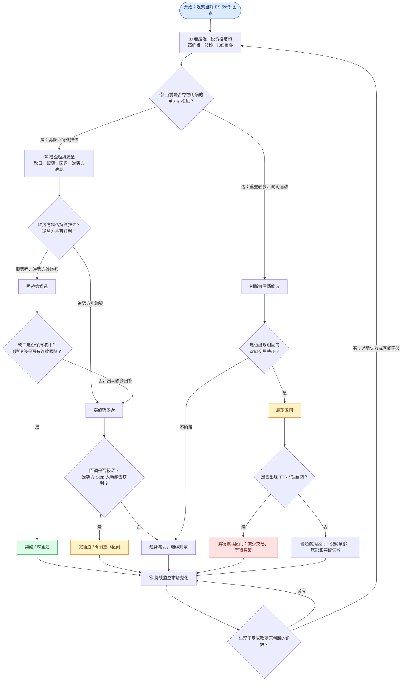

```mermaid

flowchart TD
    A([开始：观察当前 ES 5分钟图表]) --> B["① 看最近一段价格结构<br/>高低点、波段、K线重叠"]
    B --> C{"② 当前是否存在明确的<br/>单方向推进？"}

    C -->|"是：高低点持续推进"| D["③ 检查趋势质量<br/>缺口、跟随、回调、逆势方表现"]
    C -->|"否：重叠较多、双向运动"| R["判断为震荡候选"]

    D --> E{"顺势方是否持续推进？<br/>逆势方能否获利？"}
    E -->|"顺势强，逆势方难赚钱"| F["强趋势候选"]
    E -->|"逆势方能赚钱"| G["弱趋势候选"]

    F --> H{"缺口是否保持敞开？<br/>顺势K线是否有连续跟随？"}
    H -->|"是"| I["突破 / 窄通道"]
    H -->|"否，出现较多回补"| G

    G --> J{"回调是否较深？<br/>逆势方 Stop 入场能否获利？"}
    J -->|"是"| K["宽通道 / 倾斜震荡区间"]
    J -->|"否"| L["趋势减弱，继续观察"]

    R --> M{"是否出现明显的<br/>双向交易特征？"}
    M -->|"是"| N["震荡区间"]
    M -->|"不确定"| L

    N --> O{"是否出现 TTR / 铁丝网？"}
    O -->|"是"| P["紧密震荡区间：减少交易，等待突破"]
    O -->|"否"| Q["普通震荡区间：观察顶部、底部和突破失败"]

    I --> S["④ 持续监控市场变化"]
    K --> S
    L --> S
    P --> S
    Q --> S

    S --> T{"出现了足以改变原判断的证据？"}
    T -->|"没有"| S
    T -->|"有：趋势失效或区间突破"| B

    style A fill:#dbeafe,stroke:#2563eb,color:#1e3a8a
    style I fill:#dcfce7,stroke:#16a34a,color:#14532d
    style K fill:#fef3c7,stroke:#d97706,color:#78350f
    style N fill:#fef3c7,stroke:#d97706,color:#78350f
    style P fill:#fee2e2,stroke:#dc2626,color:#7f1d1d

```